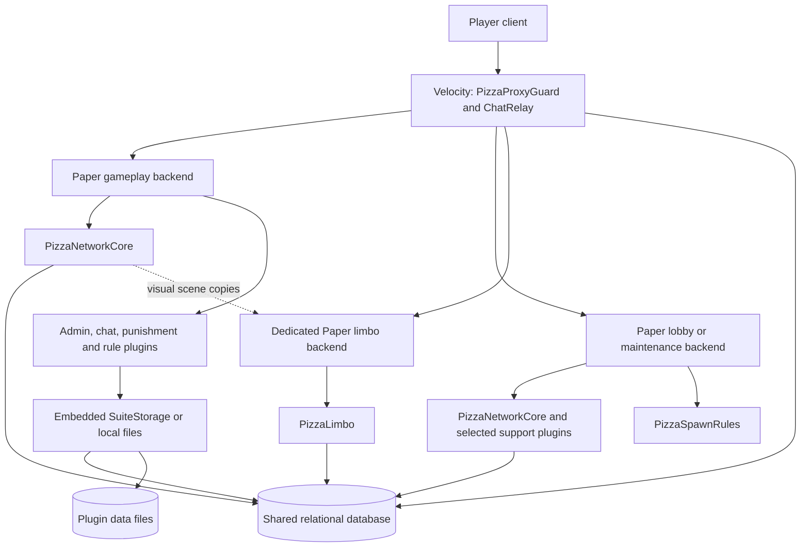
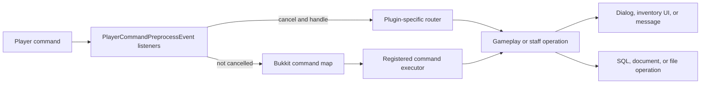
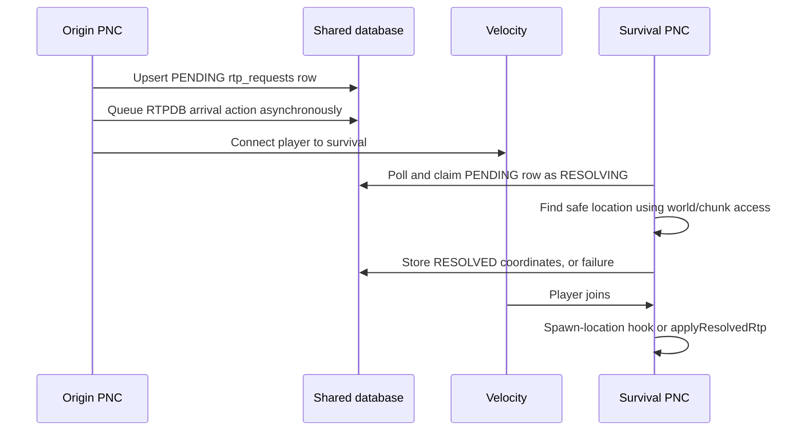

# SMP-Core architecture

## Scope and reading guide

SMP-Core is a suite of independently loaded Minecraft plugins, a shared storage library, and operational tooling. It is not a single application with a central dependency-injection container. Paper starts each backend plugin; Velocity starts the proxy plugin. Most integration occurs through Bukkit events, command dispatch, shared database tables, or plugin messages.

This document describes the implementations in this repository. It does not establish which artifacts or configuration are installed on a running network. Deployment examples, comments, and roadmap entries are not evidence that a feature is active.

Start with [PizzaNetworkCore.java][pnc], then follow the extracted [PlayerSyncManager][sync], [MaintenanceQueueManager][maintenance], and [PizzaEconomy][economy] classes. Most gameplay logic remains in the main class. Method names below are navigation anchors: search for their declarations and callers rather than relying on directory names to imply separate services.

## Runtime boundaries



The diagram shows supported code paths, not a required topology. A gameplay backend can run without a proxy, but PNC still requires its database for economy and other persistent features. A network-maintenance backend running PNC and a dedicated backend running PizzaLimbo implement different holding mechanisms; they are not interchangeable names for one service.

| Component | Implementation and responsibility |
| --- | --- |
| PizzaNetworkCore (PNC) | [Main class][pnc]: commands, GUIs, markets, social features, teleport routing, combat rules, statistics, branding, HUD, and integration orchestration. |
| PlayerSyncManager | [Backend manager][sync]: shared player snapshots, presence leases, logout metadata, and one-time arrival actions. Owned by PNC. |
| MaintenanceQueueManager | [Backend manager][maintenance]: database-driven maintenance state, holding transfers, and return queues. Owned by PNC. |
| PizzaEconomy / PizzaPlaceholders | [Vault adapter][economy] and [PlaceholderAPI adapter][placeholders]. Expose PNC balances to external consumers. |
| PizzaProxyGuard / ChatRelay | [Proxy lifecycle and routing policy][proxy], plus [message relay and presence tracking][relay]. Run in Velocity, not Paper. |
| PizzaCommon | [SuiteStorage][storage], embedded in consuming jars. It is a library, not a separately enabled plugin. |
| PizzaAdminTools | [Staff tooling][admin]: staff mode, freezes, transfers, home administration, subscription tiers, and command/menu integration. |
| PizzaChatGuard | [Chat filter][chatguard]: content policy, spam checks, and strike escalation. |
| PizzaPunishment | [PunishDropPlugin][punishment]: moderation commands/dialogs, offense and punishment records, pending actions, and flight enforcement. |
| PizzaRuleGuard | [Rule listener][ruleguard]: behavioral heuristics, inventory sanity checks, alerts, and configurable punishment dispatch. |
| PizzaSpawnRules | [Hub listener][spawnrules]: protected areas, double jump, station interactions, and gate routing. |
| PizzaLimbo | [Dedicated holding plugin][limbo]: frozen visual scene during maintenance, backend readiness checks, and return routing. |
| EnderchestExpander | [Expanded inventory plugin][ender]: separate 54-slot ender-chest inventory and local persistence. |
| PizzaUtils / PizzaTune | [Utility commands][utils] and [runtime tuning][tune]. Some commands overlap other suite plugins. |

## Initialization, scheduling, and shutdown

### PNC startup

`PizzaNetworkCore.onEnable()` performs several distinct kinds of initialization:

1. Detects the runtime, loads default configuration and branding, initializes persistent item keys, and creates the database pool.
2. Loads shop, sell-price, and worth-display configuration; obtains/registers Vault integrations.
3. Schedules `ensureUiSchema()` asynchronously. Constructs and starts `PlayerSyncManager`, whose schema initialization is also asynchronous.
4. Starts database health checks and, outside the Folia branch, `MaintenanceQueueManager`.
5. Registers its event listeners and available commands; loads world-access policy; registers outgoing `BungeeCord` and bidirectional `pizzasmp:bridge` channels.
6. Starts recurring work: player-name refresh, database notifications, RTP request polling on the survival role, playtime/shards, capacity admission, RTP matchmaking, adaptive saves, HUD-related refreshes, and cleanup tasks.
7. Schedules the automated economy and legacy team-home migration. Installs optional PlaceholderAPI and ProtocolLib integrations when available.

There is no single readiness barrier joining all schema work before every command/listener becomes available. Pool initialization uses a non-failing startup setting; a successful plugin enable does not demonstrate database readiness. Some schema errors are logged only at fine level by `execSchema()` or `addColumnIfMissing()`.

`registerCommand()` attaches an executor only when `getCommand()` returns a declaration. A call in `onEnable()` is therefore not sufficient proof that a command is registered: inspect [PNC's plugin descriptor][pnc-descriptor] as well as preprocessing listeners.

### Threading model

PNC uses scheduler adapters including `runAsyncTask`, `runOnPlayerThread`, `runPlayerTaskLater`, `runRegionTask`, and `runOnMainThread`. On ordinary Paper, player/world changes are generally scheduled through Bukkit's synchronous scheduler. Folia branches use entity, region, global-region, or asynchronous schedulers.

This abstraction is incomplete across the suite. Direct Bukkit scheduler calls remain, some event paths perform synchronous SQL, and some asynchronous tasks access Bukkit objects. A `ConcurrentHashMap` protects map operations, not arbitrary mutable values or player/world API access. The `folia-supported` descriptor field is not proof of complete region-thread safety.

SQL calls also occur synchronously through Vault, placeholder requests, GUI helpers, and maintenance join handling. Database latency can consequently affect interactive server work even where a nearby flow uses asynchronous queries.

### Proxy and support-plugin startup

Velocity injects its server, logger, and data directory into `PizzaProxyGuard`. `onInit()` loads guard configuration, schedules backend probing and maintenance polling, constructs `ChatRelay`, registers it as a listener, and initializes it. The relay loads its own configuration and JDBC driver, ensures identity/presence tables, registers its message channel, and starts lease heartbeats. Proxy event handlers then update presence on backend connection and clear reply/lease state on disconnect.

Support plugins have their own Paper `onEnable()` methods, descriptors, listeners, and scheduled tasks; PNC does not construct or shut them down as child services. Their integration is predominantly through shared data, events, and commands. Optional-provider checks are distributed across call sites, so the absence of a hard dependency in a descriptor does not guarantee every related feature can function without that provider.

### Join, quit, and disable

PNC's join listener starts player synchronization and separately initializes activity tracking, settings/friend caches, visibility, tab state, pending deliveries, and maintenance handling. These are cooperating callbacks, not one database transaction. Movement handling consults the sync manager's applying-state flag while a snapshot is being restored.

Quit handling flushes playtime, applies combat-logout handling when applicable, cancels teleports and matchmaking, removes local UI/tracking state, asks the sync manager to persist the player, and schedules advancement persistence. Airborne ender pearls are captured into an in-memory logout snapshot and recreated on return; that mechanism is not restart-durable.

`onDisable()` marks shutdown, saves online player data and visual limbo snapshots while the database is available, cancels tasks/transitions, invokes sync shutdown, closes the pool, shuts down the maintenance manager, and clears many caches. The sync manager's `runAsync()` executes inline when the plugin is no longer enabled, allowing shutdown snapshot/lease work to complete without submitting rejected scheduler tasks. This does not establish a barrier for all previously submitted asynchronous work or a distributed flush acknowledgement.

## Commands, events, and user interfaces

### Command ownership

Commands have two entry paths:



PNC's `onPayFirst`, `onSpawnRoute`, and `onTeleportCommandDelay` intercept important commands before `onCommand()`. The latter name is historical: its implementation includes broad command/UI routing, not just teleport timing. Bypass state prevents recursion when commands are redispatched.

AdminTools, ChatGuard, and EnderchestExpander also preprocess commands. For example, ChatGuard inspects private-message command bodies, and EnderchestExpander redirects `/ec`, `/enderchest`, and `/endersee` independently of a normal executor. Console commands do not take the player preprocessing path.

When tracing a command, inspect its descriptor/aliases, preprocessing handlers and event priorities, permission checks, executor, and any `performCommand`/`dispatchCommand` calls. Do not assume a permission declared for another plugin's executor protects an interception path. Listeners at the same priority may also make effective behavior dependent on plugin registration order.

### Dialog and inventory UI layers

PNC is not organized around standalone GUI controllers. It builds dialogs and inventories inside [the main class][pnc], with per-player state in maps such as `ordersViewState`, `ahViewState`, `orderFulfillmentState`, and pending text-input structures.

`useDialogUi(Player)` selects inventory fallback for detected Bedrock players and for known older ViaVersion protocols. Unknown protocol values and absence of ViaVersion select dialogs. `dialogClick()` redispatches callbacks through the player scheduler. This is capability selection by the implementation's checks, not a universal client compatibility guarantee.

Inventory menus use titles to select handlers and persistent item data such as `ui_action` to encode actions. Click, drag, and close listeners are part of the workflow. Closing an order-delivery inventory, for example, extracts eligible items into confirmation state; it is not merely a cosmetic event. Close-bypass sets distinguish navigation from cancellation in selected flows.

Chat can serve as a form input: pending admin or UI input consumes an asynchronous chat event and schedules the callback on the player thread. However, ChatGuard runs earlier at `LOWEST`, so its cancellation can prevent PNC's later input handler from receiving a message.

### HUD and integrations

PNC builds sidebar, tab, money nametag, sound, and notification output from settings, balances, statistics, and branding. Optional ProtocolLib listeners modify selected outgoing effects according to player settings. [PizzaPlaceholders][placeholders] exposes `pizzasmp_balance` and `pizzasmp_balance_raw` through PNC balance methods; it does not maintain a separate economy store. External TAB configuration is a consumer, not the source of balances.

## Persistence and shared state

### Four storage boundaries

| Boundary | Data and ownership | Important property |
| --- | --- | --- |
| PNC relational storage | Players, balances, settings, statistics, homes, markets, social relationships, teleport requests, notifications, audits, snapshots, and maintenance state. | Explicit SQL, mostly inside PNC; no ORM or repository layer. |
| SuiteStorage documents | AdminTools, ChatGuard, and Punishment documents, selected by namespace. | YAML files or serialized YAML text in SQL rows; not the same model as PNC's tables. |
| Local plugin/world files | Expanded ender chests, SetHome-compatible data, branding, rule logs, advancement files, and world regions. | Sharing the PNC database does not share these automatically. |
| Process-local state | GUI state, cooldowns, combat tags, pending tasks, cached names/settings, reply targets, and in-flight guards. | Lost on restart and not generally invalidated across servers. |

### Relational access and schema

`ensureDataSource()` creates PNC's HikariCP pool from `sync.database.*`; `openSyncConnection()` returns a pooled connection or falls back to per-operation JDBC connection creation. `PlayerSyncManager` uses the shared PNC connection path. `MaintenanceQueueManager`, `ChatRelay`, and PizzaLimbo instead open their own direct JDBC connections.

`sync.enabled` controls the sync manager, not all SQL or all network-related behavior. PNC's bundled [configuration][pnc-config] currently enables sync. Chat interception and global-chat forwarding have separate flags, both disabled in that bundled file. Maintenance setup is independent of the sync flag on the ordinary Paper startup path.

The [bootstrap schema][schema] and runtime schema methods must be read together. Runtime owners include `ensureUiSchema`, `ensureFollowsSchema`, `ensureIgnoresSchema`, `ensureAdvancementSchema`, and each manager's `ensureSchema`. Runtime additions such as `rtp_requests`, `player_ignores`, and `player_advancements` are not all present in the bootstrap SQL. Conversely, a table declaration such as `duel_matches` or `transfer_locks` does not demonstrate an implemented match lifecycle or locking protocol.

Important table groups:

| Tables | Primary role |
| --- | --- |
| `players`, `session_leases`, `player_logout_meta` | Identity/name lookup, network presence, and reconnect routing. |
| `player_sync_state`, `player_transfer_actions`, `player_advancements` | Inventory/state snapshots, pending arrival intent, and advancement JSON blobs. |
| `balances`, `player_stats`, `player_settings` | Economy, gameplay statistics, and persisted player options. |
| `auction_listings`, `auction_payouts`, `order_listings`, `order_deliveries` | Market state and deferred claims. Item stacks are serialized into blobs where required. |
| `homes`, `teams`, `team_members`, `team_invites` | Home records and retained team functionality. |
| `follows`, `friends`, `player_ignores` | Current follow relationships and privacy, alongside older friend storage. |
| `network_teleport_requests`, `rtp_requests`, `network_player_notifications` | Cross-backend requests and queued delivery. |
| `maintenance_state`, `maintenance_queue`, `maintenance_return_queue` | Network-maintenance coordination. |
| `limbo_snapshots`, `limbo_control` | Dedicated limbo scene and control signals. |
| Audit/chat/command tables | Operational history; not an event-sourcing log capable of rebuilding all gameplay state. |

### SuiteStorage

[SuiteStorage.fromConfig()][storage] selects YAML or MySQL from each consuming plugin's `storage` section. MySQL initialization failure falls back to YAML. That fallback preserves local operation but stops cross-backend sharing; it is not an offline replication queue.

`loadDoc`/`saveDoc` address a named document. `loadPlayer`/`savePlayer` address a player document. SQL storage uses `suite_docs(namespace,name,data)`, `suite_player(namespace,uuid,data)`, and append-only `suite_events`. Consumers retain YAML-shaped data rather than querying normalized fields.

Loading can read fresh database content, but callers may keep local copies. Saving replaces a whole document without a version check or merge transaction. Two servers editing the same cached document can overwrite each other's updates. One-shot YAML import is flag-file guarded; it is not continuous file/database synchronization. Although the library has `close()`, the inspected AdminTools and Punishment disable methods do not invoke it.

### Cache consistency

PNC caches network names, player settings, mutual-friend results, menu listings, and other derived values. Refresh tasks and join/quit callbacks update selected caches. The auction purchase path updates local viewers after a sale; that is not a network-wide cache-invalidation broadcast. Relational checks during a mutation remain important even when the displayed GUI was recently loaded.

Several similarly named queues are unrelated: PNC's local capacity admission queue, its local RTP matchmaking queue, database RTP requests, and the maintenance return queues. They have different owners, persistence, and completion rules.

## Economy and market execution

### Vault and balances

[PizzaEconomy][economy] extends Vault's `AbstractEconomy`. PNC registers it at high service priority when configured to provide Vault economy. Other plugins can then reach the same `balances.money` column through Vault. Bank operations are unsupported.

Withdrawal uses a guarded update rather than a read-then-write balance test:

```sql
UPDATE balances
SET money = money + ?
WHERE uuid = ? AND money + ? >= 0
```

This prevents a single debit from taking that row below zero. It does not make a larger purchase or transfer atomic. `/pay`, for example, resolves a local target or known offline identity, withdraws, then deposits through separate operations. Online and offline branches also take different privacy/lookup paths; they should not be assumed equivalent.

Shop purchases, sell inventories, sell-multiplier progress, shard spending, and market actions are implemented in PNC using a mixture of Vault calls and direct SQL. Shards share `balances` but use separate increment/decrement helpers. `startPlaytimeAndAfkTask()` updates playtime and grants passive shards on clock slots; the slot tracker is local memory, not a database-wide deduplication key.

### Auction purchase

The auction flow illustrates the actual transaction boundary:

```mermaid
sequenceDiagram
    participant U as Player / GUI
    participant C as PNC
    participant A as Listing SQL connection
    participant V as Vault / balance connection
    U->>C: Confirm listing purchase
    C->>C: Local in-flight guard and capacity check
    C->>A: Begin transaction; SELECT listing FOR UPDATE
    C->>V: Withdraw buyer funds
    V-->>C: Debit result
    C->>A: Mark sold; record payout; credit seller
    C->>A: Commit
    C->>U: Scheduled inventory delivery
    C->>C: Audit, notification, local GUI refresh
```

`ahBuyInFlight` guards duplicate local attempts. Row locking and status checks coordinate listing ownership in SQL. However, `withdrawMoney()` is outside the listing transaction, and item delivery occurs after commit on a player callback. A rollback of the listing connection does not automatically reverse the Vault debit; a committed purchase is not atomically coupled to delivery into a live player inventory. The implementation therefore does not provide end-to-end exactly-once purchase semantics.

### Buy orders

`createOrderFromBuilder()` validates an order and withdraws its funding before the asynchronous listing insertion; selected failure branches refund it. Delivery begins with `openOrderDeliveryInsert()`. The close handler collects matching items, including supported shulker contents, and builds pending confirmation state.

`applyOrderDelivery()` locks the order row, checks status/remaining quantity, updates the filled amount, and records serialized deliveries and payout amounts in one SQL transaction. The caller coordinates physical items and payment outside that transaction. Claim flags and row locks protect selected database transitions, but do not make Bukkit inventories transactional.

### Automated economy

`initAutoEco()` creates a synthetic server identity and schedules listing, order creation, buying, and delivery passes. These use the same market tables as players. Prices derive from sell configuration and explicit material-specific rules. The feature is present in this checkout, not merely a roadmap item. Task scheduling is per PNC instance; there is no leader election at the scheduler boundary, so a multi-backend deployment must account for where these tasks run.

## Player synchronization and cross-server movement

### Snapshot lifecycle

[PlayerSyncManager.handleJoin()][sync] creates a local lease token, marks the player as applying state, and asynchronously reads logout metadata, upserts identity/presence, loads a snapshot, and consumes an arrival action. Its player-thread continuation applies the snapshot or reconnect policy and clears applying-state tracking.

A snapshot includes serialized player inventory and vanilla ender chest, health/food/experience and related state, game mode, movement fields, server, and location. Location restoration is conditional on backend/world compatibility and pending RTP intent. Game-mode restoration is reinforced by delayed tasks; survival flight is not restored blindly from an old hub snapshot.

Quit captures state and schedules persistence, logout metadata updates, and token-guarded lease deletion. Advancement synchronization is a separate PNC path that reads/writes the world's advancement JSON files around login and saves; it is not part of the inventory blob.

Both the proxy relay and backend sync manager write `session_leases`. Their expiry timestamps are computed in SQL. Upsert replaces the current token/server, while deletion guards against deleting another token. This is presence and routing coordination, not exclusive lock acquisition: snapshot upserts themselves are not fenced by a lease token, and a late writer can overwrite a newer snapshot.

### Arrival actions and transfers

`queueOneTimeAction()` stores a per-player action and expiry in `player_transfer_actions`. `consumeOneTimeAction()` locks, reads, and deletes it in a transaction. Supported action forms include `TPTO`, `RTPDB`, `RTPAT`, `RTP`, and `RUN_CMD`. The destination interprets the string after joining.

There is only one pending action row per player. Consumption precedes execution; there is no durable execution acknowledgement/retry log. Queueing is asynchronous, and some callers initiate a proxy connection without waiting for its write to complete. Database consumption alone therefore does not prove the action will execute exactly once after transfer.

Backend connection requests use the BungeeCord-compatible `Connect` plugin message. Proxy server names and backend role detection must agree. Teleport requests additionally use `network_teleport_requests`, database presence lookup, and notification polling to reach players on another backend.

### RTP

Local RTP flows through `beginRtpSearch`, an `RtpSearchPlan`, asynchronous chunk access, safe-ground evaluation, then player-thread teleport and arrival grace. It checks world-access restrictions and configurable ground/radius criteria. The presence of asynchronous chunk loading does not imply it only uses pregenerated chunks: generation-enabled calls exist in the implementation.

Current cross-server RTP starts from a database request rather than depending on a player already connected to the destination:



Search and transfer overlap; the diagram does not require resolution before join. The destination caches resolved locations for its spawn hook and also handles players already waiting. Claiming uses a status-guarded update. Expiry and failure paths exist, but request processing is not a general durable job system with acknowledged retries after worker failure.

The bridge still contains `RTPREQ`, `RTPFIND`, `RTPRES`, `RTPGO`, and fallback handling. Those message handlers coexist with the database path; their presence should not be mistaken for the main path invoked by `requestCrossServerRtp()`.

### Homes and RTP matchmaking

PNC's `homes` records store world names and coordinates. `teleportToHomeRecord()` resolves a loaded world and checks combat state before teleporting. Backend routing and local world lookup are separate concerns. AdminTools also reads and writes SetHome-compatible YAML, and PNC contains a legacy team-home migration into that file model. There is no single universal home repository behind every command.

`tickRtpDuelQueue()` matches local queued players by armor/weapon/enchantment score with a widening acceptable gap. `startRtpDuelMatch()` removes the pair and starts a shared safe-location search. This is RTP matchmaking, not a multi-round arena snapshot/rollback system with wagers or an isolated duel world. SQL table names and a hub's `warp duels` command do not establish those features.

## Chat, social state, and moderation

### Chat pipeline

[PizzaChatGuard.onChat()][chatguard] runs at `LOWEST`, inspecting rate, duplicate/near-duplicate, caps, content, and advertising rules. Text normalization includes configurable words and leetspeak handling. Soft spam/caps violations warn; harder violations update strikes and escalate. Strikes use SuiteStorage, but the plugin also retains local maps. Private-message filtering is a command-preprocessing path rather than a proxy text filter.

PNC's later asynchronous chat listener first handles pending UI inputs, then checks chat interception/settings/mute/team state. With global forwarding enabled it cancels local chat, writes a log asynchronously, and sends a bridge payload. Team chat uses a different payload. Local echo is separately controlled, so forwarding and echo configuration must be considered together to avoid duplicate or missing output.

[ChatRelay][relay] registers `pizzasmp:bridge`, marks matching events handled, and accepts messages from backend `ServerConnection` sources. Payloads use `DataInputStream`/`DataOutputStream` fields, not JSON or an RPC framework. The relay trusts backend-supplied identity fields; this is a trusted-backend boundary.

`CHAT` broadcasts through the proxy with recipient settings checks. `MSG` and `REPLY` use proxy-online players and an in-memory reply map. `TEAM` uses the supplied recipient list. Recipient settings are read via JDBC, including parsing `settings_blob`; these calls are not all mediated by a shared cache or connection pool.

### Social and combat policy

PNC retains team tables and commands while its follow model uses directional `follows` rows; mutual follows underpin friend-related behavior. `notifyFollowers()` filters events using relationship options and two-way ignore checks, then delivers through notification mechanisms. Older `friends` storage and retired team-home paths remain, so “friends” and “teams” should not be treated as synonyms for one current schema.

Combat tags, arrival grace, teleport eligibility, damage handling, and death listeners live in PNC. Death handling updates kills/deaths/shards and bounties, cancels matching state, handles pearls, and replaces ordinary drop spawning with tracked items protected from selected despawn behavior. A `death_chests` schema does not mean all deaths are implemented as chest storage.

### Staff and punishment responsibilities

[AdminTools][admin] loads persisted staff mode, subscriptions, maintenance-transfer state, and night vision, then registers commands/listeners and refresh tasks. Its menus often dispatch commands supplied by other plugins. Subscription changes interact with permission groups through commands rather than a shared Java service interface. Its SetHome-compatible file handling is separate from SuiteStorage documents.

[PunishDropPlugin][punishment] loads punishment presets, locations, pending actions, records, offenses, and flight policy. It provides moderation dialogs and command execution, records suite-specific metadata, and delegates selected enforcement to LibertyBans through namespaced console commands with fallback dispatch. Scheduled pending actions are reconstructed from persisted records. Consequently, its record documents and the external punishment provider's state are distinct stores, not one atomic ledger.

Punishment also rechecks allowed flight every second and on relevant player events. This matters when diagnosing movement: the hub's double-jump controller and the punishment plugin can both write flight flags. Similar overlap exists between AdminTools, Utils, and PNC night-vision controls.

[RuleGuard][ruleguard] samples movement, inventory actions, block placement/breaking, combat clicks, and crafting. It uses local windows/cooldowns to score heuristic behavior, optionally sanitizes illegal stacks, writes `offenses.log`, and dispatches configured punishment commands. It is not a packet-level replacement for external anticheat. Its account-limit integration remains an extension point; the implementation warns when enabled without a backend.

## Maintenance, hubs, and proxy policy

### Database-driven network maintenance

[MaintenanceQueueManager][maintenance] polls `maintenance_state`, moves affected players through proxy connection requests, and records desired return targets and priorities in queue tables. Lobby/maintenance roles run holding and drain tasks. When maintenance ends, the drain selects a batch, marks attempts, initiates transfers, and removes entries.

Queue removal is not conditioned on a proxy transfer-success acknowledgement. Several SQL failures are swallowed. This is a best-effort queue, not a lossless message broker. [backend_maint.sh][maint-script] is an additional writer/control surface that plans and applies backend restarts through the operational scripts.

[PizzaProxyGuard][proxy] independently polls maintenance state, prevents selected connections, and relocates affected players. A network-wide target blocks new login; per-backend flags affect pre-connect and relocation behavior. Emergency-marked targets receive distinct handling. These decisions are separate from a backend manager's local state refresh.

The proxy also probes the gameplay backend and handles kicks. It classifies shutdown-like reasons using text fragments, redirects those cases to a fallback, and disconnects other kicks. This is a heuristic, not a structured distinction supplied by the moderation provider. The `noBackendAvailable()` check examines registered/maintenance-eligible servers rather than proving all of them reachable; the existence of a ping task does not make that particular login check a complete liveness gate.

### Dedicated visual limbo

PNC's `startLimboMaintenance()` saves player/world data, captures inventory/location into `limbo_snapshots`, prepares region bounds, copies region and advancement files, requests proxy transfers, and coordinates restart work. Region copying requires an external filesystem layout accessible to the process. It is a visual copy, not a second authoritative gameplay world.

[PizzaLimbo][limbo] loads those snapshots, places players in Adventure mode with temporary invulnerability/flight, and blocks position changes while allowing camera rotation. Interaction, inventory, building, damage, and hunger events are suppressed. Its snapshots are visual inventory copies; PizzaLimbo does not synchronize that inventory back as authoritative gameplay state.

Return decisions combine a TCP probe, grace timing, `limbo_control` readiness/force-return signals, and closed-world state. Branding reload also uses that control row. PNC's world-access controls can hold players from selected worlds independently of a whole-server restart. This design requires source-world naming, copied-file destinations, database settings, and proxy server names to agree; the repository alone does not establish a working installation.

### Hub behavior

[PizzaSpawnRules.onEnable()][spawnrules] activates only on hardcoded backend port values. Protection scope is coordinate-based, with whole-world locking selected by one of those roles; it is not a generic configurable region service. It enforces world rules, maintains spawn structures/stations, and can perform explicit cleanup edits to the hub map.

Gate-pad movement dispatches warp commands after a cancellable countdown. Tagged station interactions dispatch configured commands. Double jump temporarily uses client flight permission, cancels the flight-toggle event, and applies velocity; a tick task reconciles permission state. The deploy script restricts this jar to hub backends, but that operational convention is distinct from the plugin's port-based activation test.

### Expanded ender chest and tuning plugins

[EnderchestExpander][ender] redirects vanilla chest opening and selected commands into a cached 54-slot inventory. First load can seed from the vanilla chest. It writes compressed Bukkit-serialized arrays under its own `enderchests` data directory, with a five-second write throttle and periodic saves. It does not write the expanded contents back to the vanilla ender chest or PNC's sync snapshot. Close/quit saves are throttled too, and there is no explicit disable flush in this class.

[PizzaUtils][utils] stores night-vision choices locally and provides ping/view-distance commands. [PizzaTune][tune] changes live view distance and uses reflection into Paper's global configuration for chunk rates. These controls can overlap PNC's adaptive tuning and other command providers. Reflection-based tuning depends on the actual server implementation; it is not a stable suite API.

## Configuration, builds, and operational tooling

Configuration is distributed rather than centrally validated:

- PNC: [config.yml][pnc-config], shop data, generated/loaded sell and worth configuration, branding profiles, and world-access state. Many defaults also live in Java getters.
- SuiteStorage consumers: each plugin's `storage` section and its own policy/document files.
- Proxy: `config.properties` for guard/routing options and `bridge.properties` for relay/database options, loaded in separate classes.
- PizzaLimbo: its adjacent source resources contain its descriptor/configuration; its database keys use `db.*`, not PNC's `sync.database.*`.
- Operational scripts: target definitions, plugin manifests, service settings, and deployment configuration outside plugin APIs.

Changing a YAML value is not proof it is live. Some values are captured in constructors, some read on demand, and others require explicit reload methods. Server role names and hardcoded port tests also influence behavior independently of configuration labels.

Price configuration has a further external dependency: `loadSellConfig()` looks for a deployment-level `configs/sell/prices.yml` and falls back to an empty price map when it is unavailable. `loadWorthConfig()` searches reused or installed Essentials worth data. Bundled shop entries therefore do not establish that selling, worth display, and automated market pricing have all their required inputs.

### Build and packaging boundaries

The source layout uses `src/` and varies resource/descriptor placement across modules. [PNC's Maven file][pom] targets Java 21 and declares local system-path dependencies, but is not a complete self-contained suite build: the main source references integrations not fully represented there, and its nonstandard resource directory needs packaging attention.

[build_from_repo.sh][build] shows the fuller packaging model: compile Common, include it in AdminTools/ChatGuard/Punishment jars, compile individual plugins against server/integration dependencies, copy descriptors/resources, and build the Velocity plugin separately with its JDBC driver packaged. However, it expects an external `SMP/tools` layout and dependency caches that do not match this checkout's top-level module layout. Its default build set also omits PizzaLimbo. It should not be described as a verified clean-checkout build command.

[deploy_plugins.sh][deploy] routes Paper and Velocity artifacts separately, restricts SpawnRules to hubs, checks jar drift/dependencies, and copies a referenced datapack. The script expects runtime directories and datapack sources not supplied by this source tree. [setup-server.sh][setup] provisions dependencies and branding, but also assumes script/resource placement that needs reconciliation with this checkout.

### Operator interfaces and tests

[tools/pizzactl.py][tui] is a curses interface with three control planes: SQL subprocess queries for dashboards/audits, console commands injected through a screen session, and shell-script calls for maintenance/server operations. It is not an HTTP service or a public plugin API. Its database schema and process-layout assumptions couple it to the deployment.

[network/scripts/lib.sh][ops-lib] supplies shared service/configuration helpers used by startup, restart, database, deployment, and maintenance scripts. [smoke_test.sh][smoke] is an operational RCON probe requiring running services and external configuration; it is not an isolated unit-test suite and should be reviewed before execution because it sends commands.

No conventional Java unit/integration test suite was found in this checkout. This architecture review checked source paths and execution/data flows; it did not compile, deploy, connect test players, validate live database migrations, or prove runtime compatibility of external dependencies.

## Constraints to retain when extending the system

1. **A command is not owned solely by its executor.** Inspect preprocessing listeners and redispatch before changing authorization or behavior.
2. **A database transaction is not an inventory transaction.** Identify separate connections, scheduled delivery, refund paths, and crash windows in market work.
3. **Presence is not exclusive ownership.** Session leases have multiple writers and do not fence every snapshot write.
4. **Shared SQL does not share every feature.** Expanded chests, local homes, document caches, world files, and in-memory state have different boundaries.
5. **Maintenance has two implementations.** Do not combine queue-based holding and visual limbo assumptions without tracing their callers and return paths.
6. **Player state has multiple writers.** Flight, invulnerability, teleport grace, effects, inventory, and commands can be controlled by different plugins.
7. **Descriptors and example scripts are not runtime verification.** Folia support, provider availability, role mapping, and build/deployment completeness require separate checks.

These are properties of the current implementation, not proposed refactors. Where behavior depends on external plugins, generated configuration, world files, or absent deployment assets, the source establishes the integration boundary but not the deployed outcome.

[pnc]: PizzaNetworkCore/src/dev/pizzasmp/networkcore/PizzaNetworkCore.java
[sync]: PizzaNetworkCore/src/dev/pizzasmp/networkcore/PlayerSyncManager.java
[maintenance]: PizzaNetworkCore/src/dev/pizzasmp/networkcore/MaintenanceQueueManager.java
[economy]: PizzaNetworkCore/src/dev/pizzasmp/networkcore/PizzaEconomy.java
[placeholders]: PizzaNetworkCore/src/dev/pizzasmp/networkcore/PizzaPlaceholders.java
[pnc-descriptor]: PizzaNetworkCore/resources/plugin.yml
[pnc-config]: PizzaNetworkCore/resources/config.yml
[proxy]: PizzaProxyGuard/src/dev/pizzasmp/proxyguard/PizzaProxyGuard.java
[relay]: PizzaProxyGuard/src/dev/pizzasmp/proxyguard/ChatRelay.java
[storage]: PizzaCommon/src/dev/pizzasmp/common/SuiteStorage.java
[admin]: PizzaAdminTools/src/dev/pizzasmp/admin/PizzaAdminTools.java
[chatguard]: PizzaChatGuard/src/dev/pizzasmp/chat/PizzaChatGuard.java
[punishment]: PizzaPunishment/src/me/pizzasmp/punishdrop/PunishDropPlugin.java
[ruleguard]: PizzaRuleGuard/src/dev/pizzasmp/ruleguard/PizzaRuleGuardPlugin.java
[spawnrules]: PizzaSpawnRules/src/dev/pizzasmp/spawnrules/PizzaSpawnRulesPlugin.java
[limbo]: PizzaLimbo/src/dev/pizzasmp/limbo/PizzaLimbo.java
[ender]: PizzaEnderchest/src/dev/pizzasmp/plugins/EnderchestExpander.java
[utils]: PizzaUtils/src/dev/pizzasmp/utils/PizzaUtils.java
[tune]: PizzaTune/src/dev/pizzasmp/tune/PizzaTune.java
[schema]: network/configs/schema.sql
[pom]: PizzaNetworkCore/pom.xml
[build]: network/scripts/build_from_repo.sh
[deploy]: network/scripts/deploy_plugins.sh
[maint-script]: network/scripts/backend_maint.sh
[ops-lib]: network/scripts/lib.sh
[smoke]: network/scripts/smoke_test.sh
[setup]: setup/setup-server.sh
[tui]: tools/pizzactl.py
